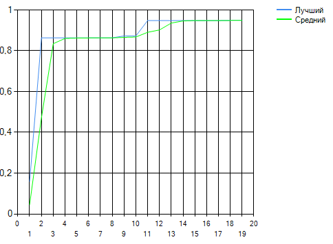

# Рубежный контроль №2 по ТСиСА №3 Петросян Артемий, ИУ8-32, Вариант №13, 40% мутации, 4 точки.

N	X	    Y	    Fit	  Max	  Midlle
1	0,304	1,025	0,158	0,158	0,044
	1,476	0,027	0,011			
	1,360	-0,967	0,007			
	1,388	1,718	0,000			
2	0,738	0,062	0,427	0,427	0,196
	0,890	0,526	0,187			
	0,304	1,025	0,158			
	1,476	0,027	0,011			
3	0,738	0,062	0,427	0,427	0,346
	0,521	0,543	0,421			
	0,773	0,287	0,348			
	0,890	0,526	0,187			
4	0,629	0,303	0,474	0,474	0,429
	0,738	0,062	0,427			
	0,521	0,543	0,421			
	0,755	0,174	0,393			
5	0,582	0,380	0,479	0,479	0,460
	0,629	0,303	0,474			
	0,684	0,182	0,462			
	0,738	0,062	0,427			
6	0,633	0,281	0,480	0,480	0,477
	0,582	0,380	0,479			
	0,606	0,341	0,478			
	0,629	0,303	0,474			
7	0,607	0,331	0,481	0,481	0,480
	0,633	0,281	0,480			
	0,619	0,311	0,480			
	0,582	0,380	0,479			
8	0,527	0,262	0,590	0,590	0,508
	0,607	0,331	0,481			
	0,633	0,281	0,480			
	0,619	0,311	0,480			
9	0,527	0,262	0,590	0,590	0,535
	0,567	0,296	0,535			
	0,580	0,272	0,535			
	0,607	0,331	0,481			
10	0,527	0,262	0,590	0,590	0,558
	0,502	0,340	0,573			
	0,567	0,296	0,535			
	0,580	0,272	0,535			
11	0,527	0,262	0,590	0,590	0,577
	0,515	0,301	0,583			
	0,502	0,340	0,573			
	0,547	0,279	0,563			
12	0,527	0,262	0,590	0,590	0,586
	0,521	0,281	0,587			
	0,515	0,301	0,583			
	0,515	0,301	0,583			
13	0,478	0,233	0,651	0,651	0,604
	0,527	0,262	0,590			
	0,521	0,281	0,587			
	0,521	0,281	0,587			
14	0,478	0,233	0,651	0,651	0,612
	0,500	0,257	0,619			
	0,527	0,262	0,590			
	0,521	0,281	0,587			
15	0,478	0,233	0,651	0,651	0,631
	0,489	0,245	0,635			
	0,503	0,248	0,620			
	0,500	0,257	0,619			
16	0,478	0,233	0,651	0,651	0,637
	0,484	0,239	0,643			
	0,489	0,245	0,635			
	0,503	0,248	0,620			
17	0,478	0,233	0,651	0,651	0,646
	0,481	0,236	0,647			
	0,484	0,239	0,643			
	0,484	0,239	0,643			
18	0,445	0,229	0,684	0,684	0,658
	0,478	0,233	0,651			
	0,480	0,235	0,649			
	0,481	0,236	0,647			
19	0,445	0,229	0,684	0,684	0,663
	0,462	0,231	0,668			
	0,478	0,233	0,651			
	0,480	0,235	0,649			
